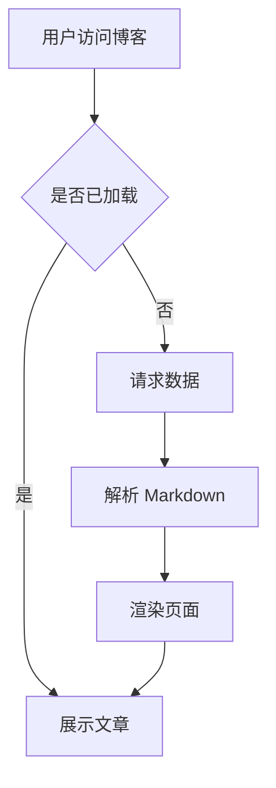

这是一篇纯粹的测试文章，用来验证博客的主题样式、代码高亮、表格渲染、图片加载等功能是否正常。如果你看到这篇文章，说明博客的基本展示能力没有问题——至少这篇文章没写崩。

- [标题层级测试](#标题层级测试)
- [文本样式测试](#文本样式测试)
- [代码块测试](#代码块测试)
- [表格测试](#表格测试)
- [列表测试](#列表测试)
- [引用测试](#引用测试)

## 标题层级测试

# 一级标题 H1

## 二级标题 H2

### 三级标题 H3

#### 四级标题 H4

##### 五级标题 H5

###### 六级标题 H6

## 文本样式测试

这是**粗体文字**，这是*斜体文字*，这是~~删除线文字~~，这是`行内代码`。

这是一段普通正文。春江潮水连海平，海上明月共潮生。滟滟随波千万里，何处春江无月明。这段文字主要用来测试正文字体、行间距、字重是否合适。如果这块看起来不舒服，那整个博客的阅读体验都会打折扣。

[这是一个链接](https://github.com)，指向 GitHub。

## 代码块测试

### JavaScript

```javascript
function fibonacci(n) {
  if (n <= 1) return n
  return fibonacci(n - 1) + fibonacci(n - 2)
}

// 打印前10个斐波那契数
for (let i = 0; i < 10; i++) {
  console.log(`fib(${i}) = ${fibonacci(i)}`)
}
```

### Python

```python
from dataclasses import dataclass
from typing import List

@dataclass
class User:
    name: str
    email: str
    active: bool = True

    def greet(self) -> str:
        return f"Hello, I'm {self.name}"

users: List[User] = [
    User("张三", "zhangsan@example.com"),
    User("李四", "lisi@example.com", active=False),
]
```

### CSS

```css
.card {
  border-radius: 12px;
  padding: 1.5rem;
  background: var(--card-bg);
  box-shadow: 0 4px 6px -1px rgba(0, 0, 0, 0.1);
  transition: transform 0.2s ease, box-shadow 0.2s ease;
}

.card:hover {
  transform: translateY(-2px);
  box-shadow: 0 10px 15px -3px rgba(0, 0, 0, 0.15);
}
```

### Shell

```bash
#!/bin/bash
# 批量重命名文件
count=1
for file in *.jpg; do
  mv "$file" "photo_$(printf '%03d' $count).jpg"
  ((count++))
done
echo "搞定，共重命名 $((count - 1)) 个文件"
```

## 表格测试

### 普通表格

| 姓名 | 年龄 | 城市 | 职业 |
| :--- | :--: | :--- | :--- |
| 张三 | 28 | 上海 | 前端工程师 |
| 李四 | 32 | 北京 | 后端工程师 |
| 王五 | 25 | 深圳 | 全栈工程师 |
| 赵六 | 30 | 杭州 | 产品经理 |

### 长内容表格

| 功能 | 描述 | 状态 |
| :--- | :--- | :--: |
| 代码高亮 | 根据语言自动应用语法高亮，支持深色和浅色主题 | ✅ |
| 响应式布局 | 自适应桌面、平板、手机等多种屏幕尺寸 | ✅ |
| 暗黑模式 | 跟随系统或手动切换暗黑/明亮主题 | ✅ |
| 全文搜索 | 支持文章标题和内容的模糊搜索 | ✅ |
| 评论系统 | 基于 Giscus 的 GitHub 评论集成 | ✅ |

## 列表测试

### 无序列表

- 前端开发
  - React 生态
  - Vue 生态
  - Svelte
- 后端开发
  - Node.js
  - Python FastAPI
  - Go Gin
- 数据库
  - PostgreSQL
  - MySQL
  - MongoDB

### 有序列表

1. 打开终端
2. 执行 `npm install`
3. 执行 `npm run dev`
4. 打开浏览器访问 `http://localhost:4321`
5. 开始愉快地写博客

### 任务列表

- [x] 搭建博客框架
- [x] 配置主题样式
- [x] 写好第一篇文章
- [ ] 配置自动部署
- [ ] 购买自定义域名

## 引用测试

> 学而不思则罔，思而不学则殆。
> — 孔子

> 任何足够先进的技术，初看都与魔法无异。
> — Arthur C. Clarke

### 嵌套引用

> 第一层
>
> > 第二层
> >
> > > 第三层 — 人类已经无法阻止嵌套引用了
> >
> > 回到第二层
>
> 回到第一层

## 分割线测试

---

上面是一根分割线，下面也是。

---

又一根。

---

## 数学公式测试（KaTeX）

行内公式：$E = mc^2$

独立公式：

$$
\sum_{i=1}^{n} i = \frac{n(n+1)}{2}
$$

$$
\int_{0}^{\infty} e^{-x^2} dx = \frac{\sqrt{\pi}}{2}
$$

## 流程图测试（Mermaid）



---

以上就是所有测试项。如果每个部分都显示正常，恭喜你——这个博客的排版没有翻车。如果有哪个地方看着不对劲，那说明此测试文章圆满完成了它的使命：找到了一个 Bug。